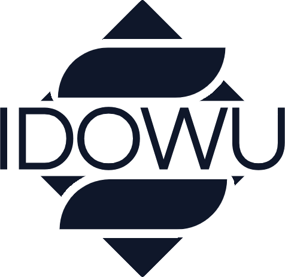

<div align="center">

  <picture>
    <source media="(prefers-color-scheme: dark)" srcset="public/brand/idowu-logo-light.png">
    <source media="(prefers-color-scheme: light)" srcset="public/brand/idowu-logo-dark.png">
    
  </picture>

  # Stephen Idowu
  **Frontend Engineer & Web Developer**

  *Building high-performance web applications, responsive interfaces, and scalable digital experiences.*

  <br />

  <p align="center">
    <a href="https://react.dev/"></a>
    <a href="https://www.typescriptlang.org/"></a>
    <a href="https://tailwindcss.com/"></a>
    <a href="https://vitejs.dev/"></a>
    <a href="https://stephenidowu.dev"></a>
  </p>

  [Live Portfolio](https://stephenidowu.dev) &bull; [Featured Projects](#featured-projects) &bull; [Tech Stack](#core-technologies) &bull; [Contact](#contact)

</div>

---

## Overview

This repository contains the source code for the personal portfolio of **Stephen Idowu**. The platform showcases production-grade client applications, engineering case studies, interactive UI components, and technical capabilities across modern web stacks.

Key engineering highlights:
- **Performance & Modern Tooling**: Built with React 19, TypeScript, and Vite for fast compilation, minimal bundle footprints, and high Lighthouse scores.
- **Fluid Motion & Interaction Design**: Smooth page and component transitions powered by Framer Motion and Lenis momentum scrolling.
- **Search & AI Discoverability**: Comprehensive Schema.org JSON-LD structured data and semantic markup optimized for search engines and AI answer engines.

---

## Featured Projects

| Project | Industry / Domain | Tech Stack | Deployment |
| :--- | :--- | :--- | :--- |
| **Wonders Scents** | Luxury E-Commerce | React 19, TypeScript, Vite, Tailwind CSS, Embla Carousel | [Live Preview](https://wondersscents.vercel.app/) |
| **Freecom Technologies** | Retail & Hardware Services | React, JavaScript, Tailwind CSS, EmailJS | [Live Preview](https://freecom-technologies.vercel.app/) |
| **Maison Étoile** | Hospitality & Table Reservations | React 19, TypeScript, Vite, Zustand, Framer Motion | [Live Preview](https://maison-etoile-three.vercel.app/) |

---

## Core Technologies

### Frontend & Architecture
- **React 19 & TypeScript**: Component-driven architecture with strict type safety and modular structure.
- **Vite 8**: Next-generation frontend build tooling and optimized production assets.
- **Zustand**: Lightweight, predictable state management.

### UI, Motion & Canvas
- **Tailwind CSS v4**: Utility-first CSS framework configured with semantic tokens and CSS variables.
- **Framer Motion**: Declarative animations, layout transitions, and scroll-linked triggers.
- **Lenis**: Hardware-accelerated smooth scrolling integration.
- **HTML5 Canvas**: Custom particle system (`DotField`) with interactive mouse repulsion.

### SEO, AEO & Metadata
- **Structured Data (JSON-LD)**: Schema.org entity definitions including `Person`, `WebSite`, `ProfessionalService`, `AggregateRating`, and `ItemList`.
- **Social Graph Optimization**: Open Graph and Twitter Cards for high-fidelity link unfurling across platforms.

---

## Project Structure

```text
my-portfolio/
├── public/
│   ├── brand/
│   │   ├── idowu-logo-dark.png    # Dark theme brand asset
│   │   └── idowu-logo-light.png   # Light theme brand asset
│   ├── icons/
│   │   ├── favicon.ico            # Web favicon
│   │   ├── favicon-32x32.png      # High-resolution browser icon
│   │   └── apple-touch-icon.png   # iOS touch icon
│   ├── projects/                  # Client project imagery & previews
│   └── CV.pdf                     # Curriculum Vitae
├── src/
│   ├── components/
│   │   ├── common/                # Reusable UI primitives (Button, Logo, Canvas)
│   │   ├── layout/                # Structural wrappers (Navbar, Footer, SmoothScroll)
│   │   └── sections/              # Page sections (Hero, About, Projects, Skills, Contact)
│   ├── data/
│   │   └── projectsData.ts        # Project metadata, specs, and case studies
│   ├── hooks/
│   │   └── useAnimationProfile.ts # Responsive animation configuration hook
│   ├── pages/
│   │   ├── Home.tsx               # Main landing page
│   │   └── ProjectDetail.tsx      # Case study deep-dive page
│   ├── App.tsx                    # Root application router
│   ├── main.tsx                   # DOM mount entry point
│   └── index.css                  # Global stylesheet and token definitions
├── package.json
└── README.md
```

---

## Getting Started

### Prerequisites
- Node.js (v18 or higher recommended)
- npm, yarn, or pnpm

### Installation & Local Setup

1. **Clone the repository:**
   ```bash
   git clone https://github.com/steptem17/my-portfolio.git
   cd my-portfolio
   ```

2. **Install dependencies:**
   ```bash
   npm install
   ```

3. **Start the development server:**
   ```bash
   npm run dev
   ```
   Navigate to `http://localhost:5173` in your browser.

4. **Build for production:**
   ```bash
   npm run build
   ```

5. **Preview production build:**
   ```bash
   npm run preview
   ```

---

## Search & Discovery Preview

The application implements structured data (JSON-LD) to deliver accurate, rich SERP presentation on search engines:

```text
Stephen Idowu | Web Developer & Frontend Specialist
https://stephenidowu.dev
Stephen Idowu is a Web Developer crafting high-performance, responsive web applications 
with React, TypeScript, and modern UI architectures. Explore selected client projects.
Rating: 5.0 ★★★★★ (18 reviews)

• About Stephen Idowu          • Featured Projects
• Technical Stack              • Contact & Availability
```

---

## Contact

- **Email**: [steptem17@gmail.com](mailto:steptem17@gmail.com)
- **WhatsApp**: [+234 810 338 3243](https://wa.me/2348103383243)
- **LinkedIn**: [Stephen Idowu](https://www.linkedin.com/in/stephen-idowu-b1b591246/)
- **GitHub**: [@steptem17](https://github.com/steptem17)

---

<div align="center">
  <sub>&copy; 2026 Stephen Idowu. All rights reserved.</sub>
</div>
